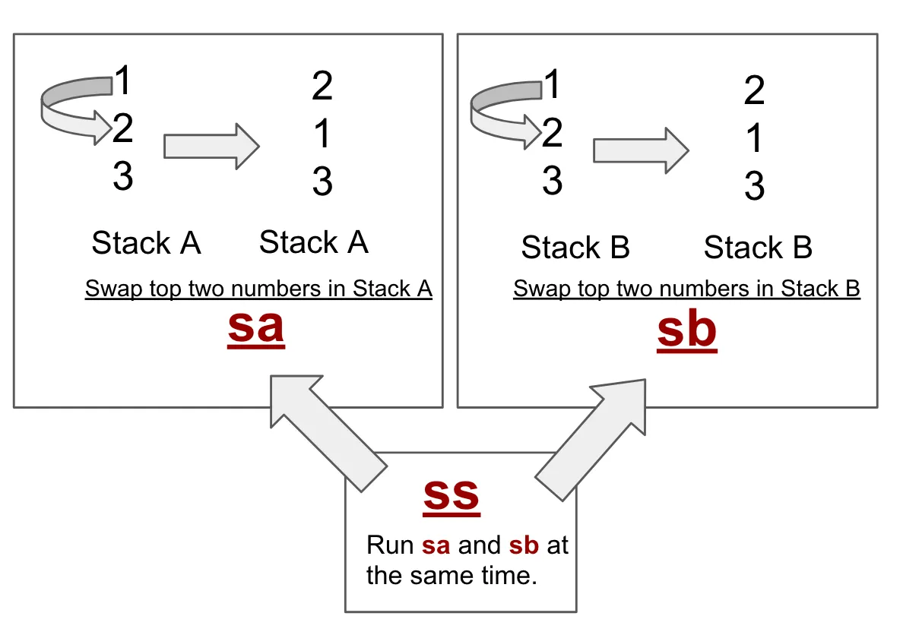
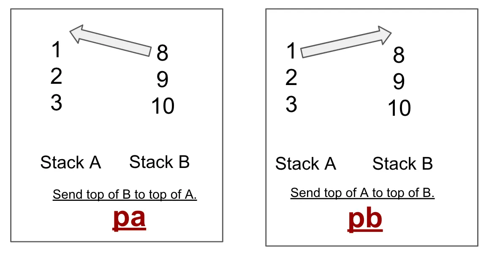
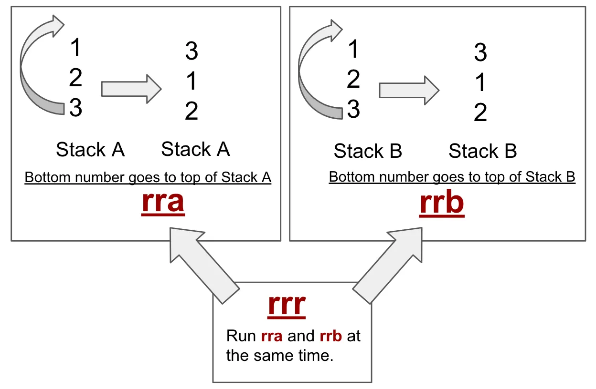
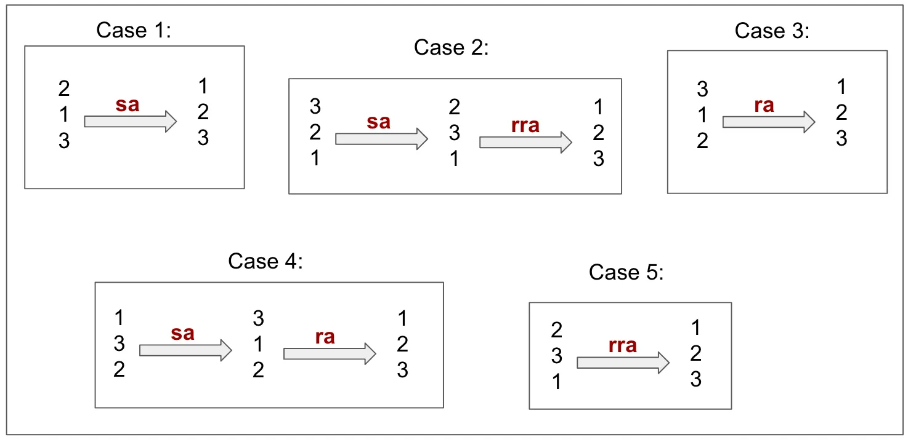
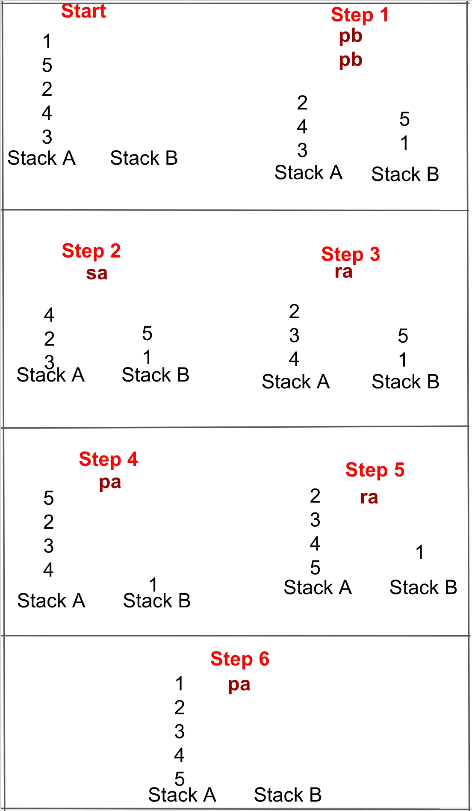

🧩 Projet Push_Swap – Mon approche
Le but est simple : on dispose de deux piles, A et B. La pile A reçoit une liste de nombres aléatoires, et notre mission est de trier cette pile du plus petit au plus grand… mais avec des actions très limitées !

 Les seules actions possibles :
 Swap :
sa, sb, ss → échange les deux premiers éléments de la pile A, B ou les deux en même temps.
Push :
pa, pb → déplace le haut d'une pile vers l'autre.

Rotate :
ra, rb, rr → fait monter tous les éléments d’un cran (pile A, B ou les deux).

Reverse Rotate :
rra, rrb, rrr → fait descendre tous les éléments d’un cran.

🔧 On doit tout coder nous-même, y compris la gestion des piles, les mouvements et les algorithmes de tri.
📸 Voir les visuels explicatifs ci-dessous

🔢 Gestion des petits cas : de 1 à 5 nombres
J’ai d’abord créé une fonction spécifique pour gérer les cas simples : 2 à 5 éléments.

🔹 Cas de 3 nombres :
Il n’existe que 5 combinaisons possibles. J’ai analysé chaque cas pour créer une solution optimale.
📸 Voir l’image ci-dessous pour les cas de 3 éléments
<

🔸 Cas de 5 nombres :
On est limité à 12 actions maximum, sinon la validation échoue.
Ma stratégie :

Je pousse les 2 plus petits éléments dans la pile B.

Je trie les 3 restants dans la pile A (comme pour le cas de 3).

Je replace les 2 éléments depuis B, au bon endroit.

Je vais maintenant illustrer ça avec le cas [1, 5, 2, 4, 3] pour montrer comment ça fonctionne.
📸 Image explicative ci-dessous

🚀 Gestion des cas de 6 à 1000 éléments – Radix Sort
Pour les entrées plus grandes (de 6 jusqu’à 1000 nombres), j’ai choisi d’implémenter l’algorithme Radix sort, une méthode simple, rapide, et surtout bien adaptée aux contraintes du projet Push_swap.

🧠 Pourquoi Radix ?
Il fonctionne très bien avec des opérations binaires.

Il est non-comparatif et exploite les bits pour trier.

Il peut être facilement adapté avec les actions autorisées du projet.

🔧 Les étapes principales de mon algo
1. normaliz_tab
La première étape consiste à normaliser les valeurs.
L’idée : remplacer chaque nombre par son indice dans la version triée du tableau.

Exemple : [42, 12, 80] devient [1, 0, 2]
Cela facilite le tri binaire car on travaille sur une base de 0 à n-1.

2. Récupérer le plus grand bit
Je calcule combien de bits il faut pour représenter le plus grand nombre normalisé.
Cela détermine combien de passes on devra faire avec Radix.

3. Appliquer le Radix sort
Pour chaque bit (du moins significatif au plus significatif) :

Je pousse dans la pile B tous les nombres où le bit courant est à 0.

Je laisse les autres dans la pile A.

Puis je remets tout dans la pile A.

Je répète l’opération pour chaque bit.

📘 Pour une explication visuelle complète, tu peux consulter la page dont je me suis inspiré pour cet algo.
Tout est détaillé et bien illustré : normaliz_tab
🔗 https://medium.com/nerd-for-tech/push-swap-tutorial-fa746e6aba1e
